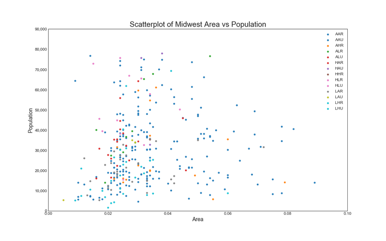

# Title

**Authors**: Anita Camlic, Eliot Kmiec

## Overview

A one-paragraph overview of the project, including the business problem, data, methods, results and recommendations.

This project explores historical data on movies, and how this data can be used to make decisions about a new movie studio. Descriptive analysis of various datasets shows that there are some variables(might not be the best word to use) are associated with higher net profit of movies. This information is used to make recommendations for this new movie studio that ensure sucess and high net income for the movies they decide to create.

## Business Problem

Summary of the business problem you are trying to solve, and the data questions that you plan to answer in order to solve them.

Microsoft is deciding to create a movie studio. Using the analysis of historical movie data, Microsoft may be able to make decisions that will result in high net income. It is important to always keep the stakeholders at the forefront of the business problem. We looked into the genres, writers,directors and the runtimes associated with the highest average net income. We looked into these because they are actionable. Microsoft needs information that they can take and then apply to their movie studio in the future.

***
Questions to consider:

* How did you pick the data analysis question(s) that you did?
* Why are these questions important from a business perspective?
***

## Data

Describe the data being used for this project.

The data that was used for this project was the IMDb dataset and the The Numbers movie budget dataset. The IMDb dataset contained 7 tables with various pieces of information about movies, directors and writers. The The Numbers movie budget dataset was comprised of the budget and gross income information for movies. The data in these datasets relate to the data analysis questions because they are about the product that Microsoft will be creating in the future. 


***
Questions to consider:
* Where did the data come from, and how do they relate to the data analysis questions?
* What do the data represent? Who is in the sample and what variables are included?
* What is the target variable?
* What are the properties of the variables you intend to use?
***

## Methods

Describe the process for analyzing or modeling the data. For Phase 1, this will be descriptive analysis.

DESCRIPTIVE ANALYSIS RECOMMENDATION 1: For the first recommendation, we looked at runtime. We used the runtimes column from the movie basics table in the IMDb dataset. We also used the worldwide gross, and production budget column from the The Numbers movie budget dataset. We joined these two datasets by the movie title. Then we prepared the data for analysis by cleaning the data. We removed duplicates,nulls and converted string values representing the budget and gross into floats. Then we looked at the descriptive statistics of the dataframe and saw that the standard deviation of the runtime was 18 mintues. So, we binned the range of values by intervals of 18 minutes and plotted that against the mean net profit for all values in each bin.

DESCRIPTIVE ANALYSIS RECOMMENDATION 2: For the second recommendation, we looked at Directors and Writers. We used the person id, primary name and death year columns from the persons table of the IMDb dataset. We used everything from the directors table in the IMDb dataset. We used the movie id and primary title from the movie_basics table in the IMDb dataset.
DESCRIPTIVE ANALYSIS RECOMMENDATION 3:


***
Questions to consider:
* How did you prepare, analyze or model the data?
* Why is this approach appropriate given the data and the business problem?
***

## Results

Present your key results. For Phase 1, this will be findings from your descriptive analysis.

RESULTS RECOMMENDATION 1:For the runtime analysis, we found that movies from 144 minutes to 162 minutes were associated with the highest mean net profit of movies. 


RESULTS RECOMMENDATION 2:
RESULTS RECOMMENDATION 3:

***
Questions to consider:
* How do you interpret the results?
* How confident are you that your results would generalize beyond the data you have?
***

Here is an example of how to embed images from your sub-folder:

### Visual 1


## Conclusions

Provide your conclusions about the work you've done, including any limitations or next steps.

CONCLUSIONS RECOMMENDATION 1:we would recommend to make movies with a runtime length within the range of 144 minutes and 162 minutes.

CONCLUSIONS RECOMMENDATION 2:
CONCLUSIONS RECOMMENDATION 3:


***
Questions to consider:
* What would you recommend the business do as a result of this work?
* What are some reasons why your analysis might not fully solve the business problem?
* What else could you do in the future to improve this project?
***

## For More Information

Please review our full analysis in [our Jupyter Notebook](./dsc-phase1-project-template.ipynb) or our [presentation](./DS_Project_Presentation.pdf).

For any additional questions, please contact **name & email, name & email**

## Repository Structure

Describe the structure of your repository and its contents, for example:

```
├── README.md                           <- The top-level README for reviewers of this project
├── dsc-phase1-project-template.ipynb   <- Narrative documentation of analysis in Jupyter notebook
├── DS_Project_Presentation.pdf         <- PDF version of project presentation
├── data                                <- Both sourced externally and generated from code
└── images                              <- Both sourced externally and generated from code
```
