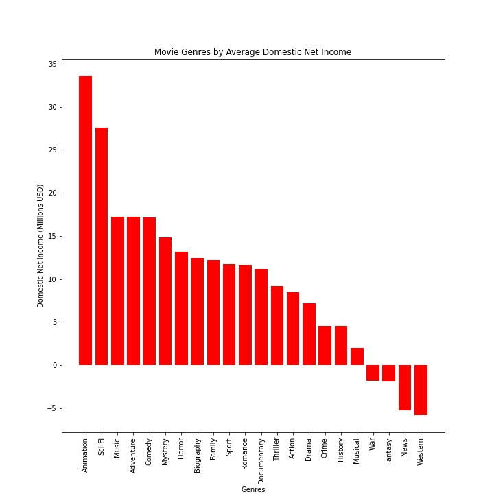
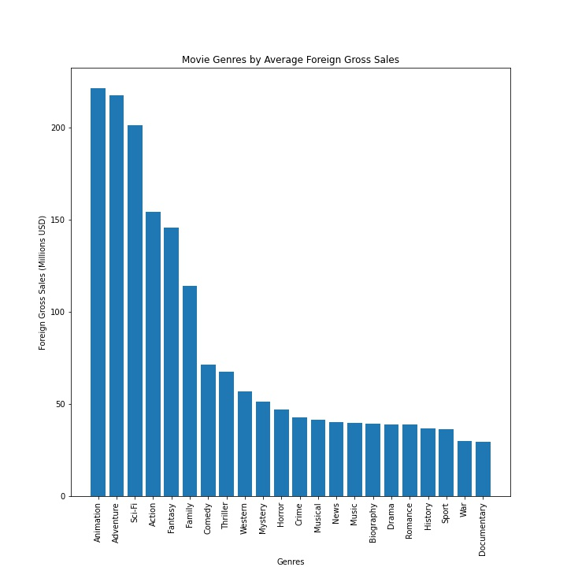
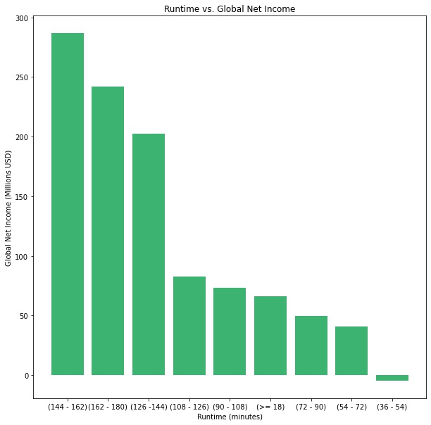
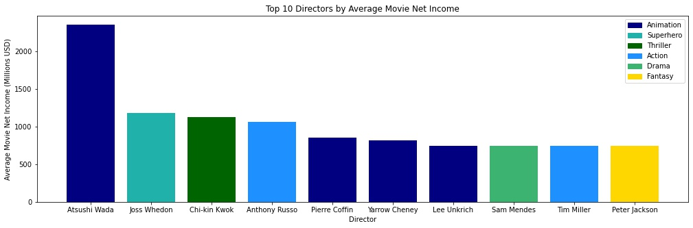
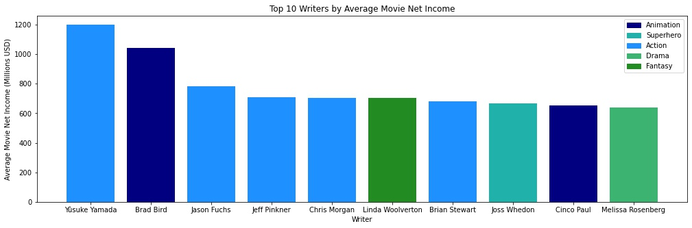

# Microsoft Movie Studio Analysis

**Authors**: Anita Camlic, Eliot Kmiec

## Overview

We were approached by Microsoft Movie Studio to use data analysis to assist in the success of the opening of their new studio. Our goal was to identify 3 contributing factors that will generate the highest success of their new studio. We used data from the IMBd public dataset and the The Numbers movie budget dataset. The metric for determining success that we used was Net Income. We calculated this by subtracting the movie budget from the gross sales. We chose this because the net income, and how much money is being made is probably the most important factor to our stakeholder. We chose the factors that we did because they are actionable. You can take our recommendations and take actions that are strongly indicated to bring success.


## Business Problem

Microsoft is deciding to create a movie studio. Using the analysis of historical movie data, Microsoft may be able to make decisions that will result in high net income. It is important to always keep the stakeholders at the forefront of the business problem. We looked into the genres, writers,directors and the runtimes associated with the highest average net income. We looked into these because they are actionable. Microsoft needs information that they can take and then apply to their movie studio in the future.


## Data

The data we used for this project is from The IMDb public datasets and the The Movie budget dataset. The IMDb dataset has 8 tables in it named movie_basics, directors, known for, movie_akas, movie_ratings, persons, principals and writers. From the IMBd dataset we used the movie_basics,directors,persons and writers tables. The The Movie budget dataset is one stand alone csv file with 6 columns, id, release_date, movie, production_budget, domestic_gross and worldwide_gross. From this dataset, we mostly used the movie,production_budget,domestic_gross and worldwide_gross tables. 


## Methods

In order to remove artifact from our final results, some cleaning of our datasets was necessary. We dropped nulls in multiple forms, converted some data stored as non-numerical types to numerical types for analytical purposes, and dropped duplicates. In the The Numbers dataset, all of the financial data was entered as strings, so we had to clean those columns. We had to make sure all of our ‘people’ analysis columns contained only directors and writers who were still alive, so we had to drop all non-null values in the death dates columns of the imdb persons data table.
The second step was the generation of the descriptive statistics provided to microsoft movie studios as the basis for our team's final recommendations. Several charts have been generated based on various features of movies and their relationship to the production thereof. Not all charts provided actionable information, and metrics have been used to demonstrate correlation strengths for certain relationships.


## Results

Our final results include the following:

Our data showed a strong relationship between the runtime range of 144 - 162 minutes and average net income of movies in that range.

The descriptive statistics for the Writer/Director analysis revealed that certain Writers and Directors are associated with higher average net income for the movies they create.

The average gross sales and net income when segmented by genre demonstrated stratified performance. Demand for some Genres was observed to be weak enough that significant business risk is associated with releasing movies within those Genres.

Our data showed average rating to be a poor predictor of profitability, and a low to moderate positive association between movie production budget and gross sales. A poor association between production budget and net profits, as well as production budget and return on investment was also observed. Further analysis is needed to turn these relationships into actionable information.


### Visuals












## Conclusions
The descriptive statistics we generated in this analysis provided three useful recommendations for Microsoft Movie Studios, and provided one area for further analysis. Three actionable business strategies were presented to Microsoft Movie Studios: 

    Create movies from 144 to 162 minutes.

    Choose from the 10 writers and directors whose movies are associated with highest average net profits. 

    Diversify Markets to increase profitability.

Based on the correlation strength of budget with gross sales, this area has been presented to Microsft Movie Studios as an area for future analysis.The correlation strength was too strong to be ignored, but not strong enough for a recommendation at this time.


## For More Information

Please review our full analysis in [our Jupyter Notebook](./Movie Studio Analysis.ipynb) or our [presentation](./Movie_Studio_Analysis.pdf).

For any additional questions, please contact **Anita Camlic & anitacamlic@gmail.com, Eliot Kmiec & eliotkmiec@gmail.com**

## Repository Structure

Describe the structure of your repository and its contents, for example:

```
├── README.md                           <- The top-level README for reviewers of this project
├── Movie_Studio_Analysis.ipynb   <- Narrative documentation of analysis in Jupyter notebook
├── Movie_Studio_Analysis.pdf         <- PDF version of project presentation
├── Data                                <- Both sourced externally and generated from code
└── images<- Both sourced externally and generated from code
```
